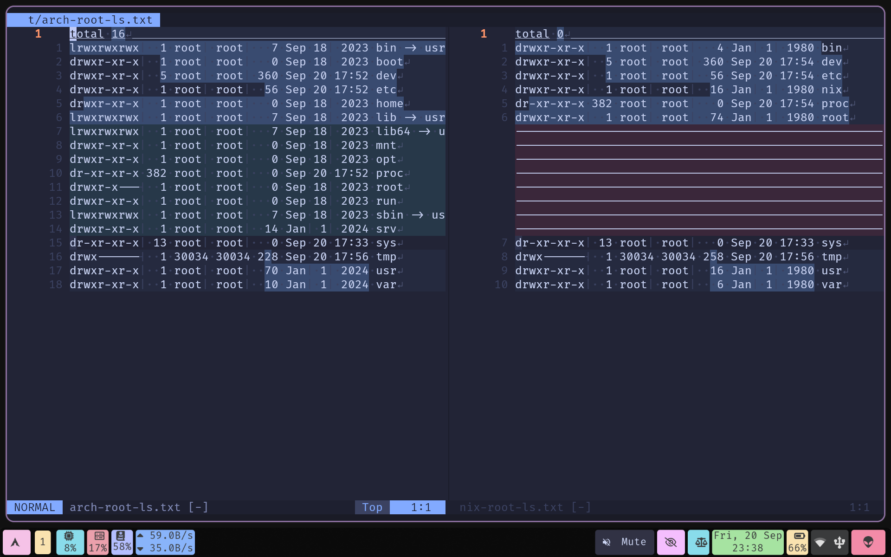
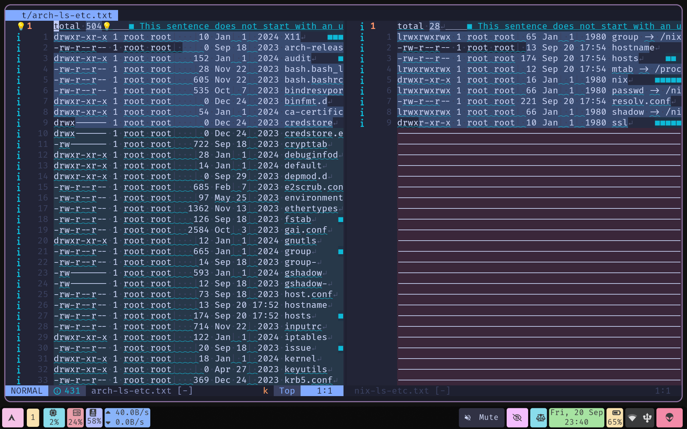
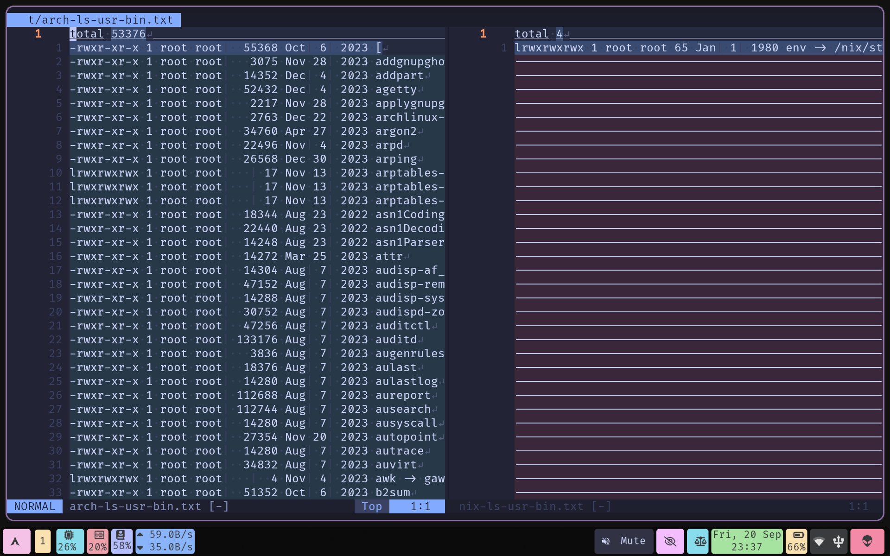

# Introduction

`🖥Computers are essential, computers are ubiquitous, computer are stupid`
`So people need to be smart to use them🤓`
`📱But smartphones are sleek, smartphones are stylish, smartphones are smart`
`And people need to be ah-ah anyway🤦`

`If you don't get it don't worry, this video is exactly for you.👀`

# What is an OS

Layer of software that manages a computer's resources for its users and
their applications. It stands between user and the machine and makes
interactions between them convenient, user-friendly, and intuitive.

`Purpose of a good OS allow the user to do what he wants without hindering.⚠️
=Yes, Microsoft! That's right.🪟`
`Just let Tim game without the updates for once.😠`

## OS Functions

### Process Management

- Starting
- Stoping
- Scheduling

### Memory Management

- Allocation
- Optimization
- Deallocation

### Resource Management

- CPU
- GPU
- Memory

### File Management

- Creation
- Deletion
- Manipulation

### IO Management

- Communication
- Connection
- Protocol

### Network Management

- Communication
- Connection
- Protocol

### Security Management

- Assessment
- Hardening
- Access Control

### Fault Management

- Logging
- Error Handling

### Recovery Management

- Backup
- Restore

### Interface Management

- API
- CLI
- GUI

## OS Components

### Kernel 🥥

| Core software that interacts with the general hardware |
|--------------------------------------------------------|
| **Windows** | **GNU/Linux** | **macOS**  | **FreeBSD** |
|-------------|---------------|------------|-------------|
| NT Kernel   | Linux Kernel  | XNU Kernel | BSD Kernel  |

### Drivers 🛠

| Modular software that interacts with specific hardware |
|--------------------------------------------------------|

| **Network** | **Graphics** | **Audio**   | **Input** | **Misc.** |
|-------------|--------------|-------------|-----------|-----------|
| Ethernet    | Integrated   | Speakers    | Keyboard  | Printers  |
| Wi-Fi       | Dedicated    | Microphones | Mouse     | Scanners  |
| Bluetooth   |              |             |           |           |

### Software 💽

| Top level unique software that handle specific processes |
|----------------------------------------------------------|

| **Bootloader**      | **Init System**        | **Software Manager**  |
|---------------------|------------------------|-----------------------|
| loads kernel        | first system process   | install/remove        |
| starts init process | starts other services  | software/applications |
| **Display Server**  | **Audio Server**       | **Network Manager**   |
| graphical rendering | sound input and output | networking interfaces |

## TLDR

`So long story short, OS is a thing we put on a thing so we can use the thing.`
`Not exactly a thing but a bunch of things. You get the point! I hope...`

# What are types of OSes

## Batch Operating System:

does not interact with the computer directly takes similar jobs with
same requirements and groups them into batches

## Time-sharing Operating System:

allows many users to share computer resources

## Distributed Operating System:

manages a group of different computers makes it appear to be a single
computer operate on a network of computers multiple users to access
shared resources communicate with each other over the network

Microsoft Windows Server Linux

## Network Operating System:

runs on a server manage over network

## Real-time Operating System:

serves a real-time system the time interval required to process and
respond to inputs is very small respond to events in real time used for
applications that require quick and deterministic responses, such as
embedded systems, industrial control systems, and robotics

## Multiprocessing Operating System:

multiple CPUs within a single computer system job can be divided and
executed more quickly

## Single-User Operating Systems:

support a single user at a time Microsoft Windows Apple macOS

## Multi-User Operating Systems:

support multiple users simultaneously Linux Unix

## Embedded Operating Systems:

run on devices with limited resources such as smartphones, wearable
devices, and household appliances Google’s Android Apple’s iOS

## Cluster Operating Systems:

run on a group of computers, or a cluster, to work together as a single
system high-performance computing for applications that require high
availability and reliability Rocks Cluster Distribution OpenMPI

# What are different OSes

| Desktop/Laptop | Mobile/Tablet  | Server            |
|----------------|----------------|-------------------|
| Windows        | Android 󰀲      | Windows Server    |
| Windows 98 󰨡   | Gingerbread 🍞 | Windows Server 16 |
| Windows 7 󰍲    | Jellybean 🍬   | Windows Server 19 |
| Windows 10 󰖳   | Oreo 🍪        | Windows Server 22 |
| Linux          | iOS 󰀷          | Linux             |
| Ubuntu 󰕈       | iOS 14         | RHEL 󱄛            |
| CentOS 󱄚       | iOS 15         | Debian 󰣚          |
| Manjaro 󱘊      | iOS 16         | Alpine           |
| BSD            | iPadOS 󰓷       | BSD               |
| FreeBSD 󰣠      | iPadOS 16      | TrueNas 󰣳         |
| OpenBSD       | iPadOS 17      | PFSense 󱂇         |
| macOS          | Chrome OS 󰊯    |                   |
| Ventura 󰇄      | Chrome OS 120  |                   |
| Sequoia 󰧨      | Chrome OS 128  |                   |

NOTE:

1.  LINUX/BSD examples here list the distros not releases.
2.  Each distro has its own releases.
3.  Each release can have its own editions/spins as well.

`The rabbit hole goes deep.🤯`

## TLDR

`There are pretty many things out there`
`that need pretty many more things to run. Yeah!?😅`
`So why you need to care because if you don't care`
`you'll will stay a noob and maybe normal🤔`

# What is Distro

A Linux Distribution (Distro) is an OS where

- Kernel → Linux Kernel
- Drivers → Open Source
- Software → GNU Utils

## OS Components for Distro

### Kernel → Linux Kernel

- Linux → Default kernel
- Linux LTS → Kernel with Long term support
- Linux Zen → Kernel with performance features
- Linux Hardened → Kernel with security features

### Drivers → Open Source Drivers

- Graphics Drivers 󰡁 → Graphics Cards
- Network Drivers 󰖟 → Network hardware
- Audio Drivers  → Speakers, microphones, etc.
- Misc. Drivers 󰐪 → Printers, scanners, etc.
- Input Drivers  → Keyboards, mouse, etc.

### Software → GNU / Non GNU

- Bootloader → GRUB, Systemd Boot
- Init System → Systemd, Runit, OpenRC
- Shell → Bash, Zsh
- Syscall Interface → Glibc, Musl
- Core Utils → GNU Coreuitls, Busybox
- Package managers → Apt, Pacman
- Display Server → Xorg, Wayland
- Display Manager → GDM, SDDM
- Desktop → Gnome, Plasma
- Audio Server → PulseAudio, PipeWire
- Network Manager → Networkd, NetworkManager

NOTE: Init System, Core Utils, Package manager, Syscall Interface cannot
be replaced by trivial means

## TIP

An easy way to system related info is to use `fastfetch`

``` bash
fastfetch -c all
# - or -
fastfetch -c ci
```

## TLDR

`Some things like some other things which are functionally same`
`but are free and open. And always keep in mind,`
`"Free as free speech and free as free beer".`

# What are different distros

Distros are different in many ways, following are some criteria to
differentiate:

## Based on Dependence Stage

### Independent/Upstream Distros

Standalone distro: Is not based on any other distro

- Archlinux 󰣇
- Debian 󰣚
- Fedora 󰣛
- Alpine 
- Etc.

### Dependent/Downstream Distros

Derived distro: Is based on an existing distro

- Archlinux 󰣇 → Black Arch
- Debian 󰣚 → Ubuntu 󰕈
- Fedora 󰣛 → CentOS 󱄚
- Etc.

## Based on Package Managers

### Dpkg, Apt → Debian, Ubuntu

Probably most well known package manager
`So well known that no one knows if its apt install or apt-get install`

### Pacman → Arch Linux, Manjaro

Probably most talked about package manager
`pacman -Syu instead of apt update && apt upgrade`
`is a great conversation starter` Probably one the fastest package
manager

1.  AUR

    Probably the biggest repository of software
    `Just kidding everyone knows Nix is the largest`

### RPM, DNF → Fedora, RHEL

Probably most slow package manager
`Actually I have no idea. I never waited long enough to actually know.`

### **NIX** → Nix OS

Probably the most advanced package manager
`A package manager so adavanced that an OS gets reduced to a bunch of lines.`

### **Distro-agnostic Package Managers**

1.  Language Independent Package Managers

    Package managers that can be installed and used on any distro

    - Brew : Isolated Applications

    `A package manager which macbook users actually know and use`

    - APX/Distrobox : Applications in containers

    `A package manager that tries so hard to be Nix`
    `as a container tries to be a distro.`

    - Flatpak : Sandboxed Applications

    `A package manager that tries to become a universal packaging solution`
    `only dawrfed by tar -xvf`

    - **NIX** : All of the above

    `Yeah! it works on every distro just like that.`
    `Why did we even bother with other package managers`

2.  Language Specific Package Managers

    These package managers are primarily used to install libraries. But
    some are used to install binary as well.

    - NPM (NodeJS)
    - PIP (Python)
    - Cargo (Rust)
    - Go Mod (Go)

## Based on Application

### Server 

- 󱂇 Hosting :  Alpine,  Rocky
- 󰋊 Storage : TrueNAS , Open Media Vault
- 󰒐 Virtual : Proxmox , Xenserver
- 󰡨 Container :  Alpine, most distros

### Workstation 󰍹

-  Development : 󰣛 Fedora, 󰕈 Ubuntu
-  Testing :  Kali , Blackarch
- 󱜏 Production : 󰣚 Debian,  Rocky

### Personal 󰌢

-  Browsing :  Chrome OS ,  Android
- 󰼭 Working : 󰣭 Linux Mint, 󰕈 Ubuntu
- 󰊗 Gaming :  Pop OS ,  Garuda

### TLDR

`Linux can cover every usecase possible. Even a toaster! if it needs one🧈`

## Based on Release cycle

### Rolling Release 

Continuous updates

- Features
- Security Fixes
- Bug Fixes

E.g. Arch Linux
`Always up to date with features, fixes or bugs. Whatever rolls your boat😎`

### Point Release 

Time bound updates

- Features

Continuous updates

- Security Fixes
- Bug Fixes

E.g. Debian `Always late to the party. But at least he is reliable🤓`

### Hybrid Release ↻

Continuous time bound updates

- Features
- Security Fixes
- Bug Fixes

E.g. Fedora
`Best of both worlds or worst of both worlds. However you feel🧐`

## Emerging Class of Distros

### Atomic 󰚤

- Updates applied in one go
- Or not applied at all

### Immutable 󰏗

- Core Software is managed
- Cannot be easily manipulated

### Declarative 󱇧

- System state is only declared
- The system itself manages the actual procedures related intricacies

### Transactional 

- System state is reversible
- System can revert to previous state

### Example

- Debian → Vanilla OS
- Fedora → Fedora Silver Blue
- NixOS

### TLDR

`Damn easy to manage, Stress free to update,`
`Pretty hard to break, Super snappy to revert.`

# What is the difference b/w Distro and OS

The classification is nominal. `OS` is a generic is all encompassing
term. `Every hardware that is interactive has an OS.`

`Distro` is primarily related to `Linux/GNU` line of `OS/software`.
`Every Distro is an OS, but not every OS is a distro.`

`Immutable` distro are branch of Distro with major tweaks. It improves
robustness and reliability of the system.
`Every Immutable Distro is a distro, but doesn't function or feel like a distro.`

# How distributions achieve immutability

## Two variables of the immutable OS equation

1.  Runtime w/o mutating root-fs
    - OSTree
    - ABRoot
    - BTRFS
    - NIX
2.  Software w/o mutating root-fs
    - Flatpak
    - Toolbox/Distrobox/APX
    - Brew
    - NIX

## How its actually used

VanillaOS: ABRoot, apx (cli), flatpak(gui) MicroOS : BtrFs ,
distrobox(cli), flatpak(gui) CoreOS : OSTree, toolbox (cli),
flatpak(gui) GNU Guix : Guix , guix (cli), flatpak(gui) NixOS : Nix ,
nix (cli), flatpak(gui)

NOTE: Distros does not require `flatpak` Though almost all use it as
default for `GUI applications` For `CLI applications` all use some
custom solution Though `distrobox` is becoming the default solution

## Flatpak/Brew

Not modifying the root-fs by choice New packages installation via
Flatpak/Brew 󰄱 immutability 󰄱 rollbacks 󰄵 distro like **Used by any
Distro**

## NIX/GUIX

## FS-Snapshot

Snapshot and store the root-fs by automation or choice Revert to the
snapshot on demand 󰄱 immutability 󰄵 rollbacks 󰄵 distro like **Used by
any Distro**

## APX/Distrobox/Toolbox

Not modifying the root-fs by automation or choice OS uses containers and
saves it as an image. Revert to older image on demand 󰄱 immutability 󰄵
rollbacks 󰄵 distro like **Used by any distro**

## AB-Root

2 partitions function as root-fs by automation Updates are applied to
the partition not in use. Post update the system switches to updated
partition. Switch to other partition if required. Linux file system
hierarchy and structure are maintained. 󰄵 immutability^\* 󰄵 rollbacks 󰄵
distro like^\* **Used by Vanilla OS** 󰎚 NOTE: Vanilla OS also used `APX`

## OS-Tree

Uses a tree like root-fs Filesystem like a `Git` repository Updates are
applied as a tree previous generation tree is stored Can switch to
previous generation Linux file hierarchy and structure are minimally
modified 󰄵 immutability^\* 󰄵 rollbacks 󰄵 distro like^\* **Used by Fedora
Silver Blue** as `RPM-OSTree` **Used by Flatpak** 󰎚 NOTE: Fedora Silver
Blue also uses `ToolBox`

## NIX

Uses Nix package manages Uses Nix store for all packages Linux file
hierarchy and structure are disregarded completely Sym-links are placed
to make packages and services available 󰄵 immutability 󰄵 rollbacks 󰄵
reproducible 󰄵 declarative 󰄱 distro like **Used by NixOS**

# What is Nix

`Build anything, anywhere, anytime`

## Nix Components/Ecosystem

| Nix                       | NixPkgs                | NixOS              |
|---------------------------|------------------------|--------------------|
| (Package Manager)         | (Package Repository)   | (Operating System) |
| Ultimate package manager  | Huge repository        | Managed system     |
| Universal package manager | Proprietary software   | Declarative        |
| No dependency issue       | Different architecture | Revert on boot     |
| No package conflicts      | Monstrous cache        | Replicable         |
| `AIO Manager`             | `Awesome repository`   | `Ultra-modern OS`  |

## Nix Specific features

### nix-shell

Checkout any package in a nix-shell Does not pollute the `path`

``` bash
# Downloads the  package
# Gives user a shell with package available
nix-shell -p $package_name

# NOTE: Flake mode
nix shell nixpkgs#$package_name
```

### nix-env

1.  Usage w/o flakes

    ``` bash
    # For package management
    nix-env -qa $search_term
    nix-env -iA nixpkgs.$package_name
    nix-env -e $package_name
    nix-env -u

    # For generation management
    nix-env --list-generations
    nix-env --delete-generations
    nix-env --switch-generations
    nix-env --rollback
    ```

2.  Usage w/ Flakes

    ``` bash
    # NOTE: Flake mode
    nix search nixpkgs $search_term
    nix profile install nixpkgs#$package_name
    nix profile remove $id
    nix profile upgrade

    # For generation management
    nix profile rollback
    ```

### nix-flakes

``` bash
nix flake init
nix flake show $path_to_repo
```

### nix-store

``` bash
nix-store --gc
nix-store --optimise
nix-store --delete $pkg_path

# NOTE: Flake mode
nix store gc
nix store optimise
nix store delete $pkg_path
```

# What is NixOS

It's hyper modern operating system build around Nix package manager. It
uses its features to trivialize the majority of chores. Most of the
system admin is done by editing `configuration.nix` file

`Need to add new software, edit the configuration file`
`Need to add new service , edit the configuration file`
`Need to add new user    , edit the configuration file`
`Need to edit config file, well you have to DIY`
`Nix won't help you there`

# Why NixOS is not (like) a Distro

## Comparison of philosophies

| **Unix philosophy**  | **NixOS philosophy**  |
|----------------------|-----------------------|
| **Modularity**       | **Reproducibility**   |
| small and simple     | same dependency       |
| fit well for big     | same program          |
| **Extensibility**    | **Availability**      |
| interface to outside | programs, tools       |
| interface to extend  | procedures, resources |
| **Simplicity**       | **Portability**       |
| do one thing         | system                |
| do it well           | architecture          |
| **Procedural**       | **Functional**        |
| sequential           | declarative           |
| stateful             | stateless             |

## Convention/Learning Issues

| Lack of conventions | More of learning |
|---------------------|------------------|
| \- FSH              | \- Specific      |
| \- Tools            | \- Unintutive    |
| \- Services         | \- Trial         |
| \- Config           | \- Error         |

### Arch vs Nix: `ls -l /`



## Simplicity/Compatibility Issues

| Lack of simplicity  | More of compatibility    |
|---------------------|--------------------------|
| Process             | Process                  |
| \- Peculiar process | \- Many redirection      |
| Environment         | Environment              |
| \- Different env.   | \- Many links            |
| Resources           | Resources                |
| \- Complex learning | \- Many ways; same thing |

### Arch vs Nix: `ls -l /etc`



## Performance/Availability Issues

| Lack of performance       | More of availability              |
|---------------------------|-----------------------------------|
| Hardware                  | Hardware                          |
| \- higher disk usage      | \- almost all hardware            |
| Software                  | Software                          |
| \- higher bandwidth usage | \- largest collection of software |
| Temporal                  | Temporal                          |
| \- higher time usage      | \- almost all version of software |

### Arch vs Nix: `ls -l /usr/bin`



# Why NixOS is "THE" best OS

## Deprecating awesome technologies

### Container Management Tools

`Docker` `Podman` `LXC` Replaced by `nix-shell` Replaced by `nix shell`

### **Package Management Tools**

`Pacman` `Apt` `Dnf` `Npm` `Pip` Replaced by `nix-env` Replaced by
`nix profile install`

### **Environment Management Tools**

`Pyenv` `Dotenv` `Direnv` `Node` Replaced by `nix develop` Replaced by
`devenv.nix`

### **Confiuration Management Tools**

`JSON` `YAML` `Ansible` Replaced by `/etc/configuration.nix` Replaced by
`/home/user/.config/nix/nix.conf` Replaced by `flake.nix`

### **Home Management Tools**

`Stow` `Bare-Repo` Replaced by `home-manager.nix`

### **User Management Tools**

`usermod` `useradd` `userdel` `groupadd` Replaced by
`/etc/configuration.nix`

### **Build Management Tools**

`Make` `Cmake` Replaced by `flake.nix`

### **Version Management Tools**

`Asdf` `Pkgx` Replaced by `flake.nix`

### NOTE:

Most of these are replaced by `nix` alone `NixOS` is not required except
for `system management`

`Nix can wrap software making it obsolete`
`But cannot replace Git though` `Either way no harm intended!`
`I guess!?`

## For target audience

### **developers/coders**

`Script Kitties, Polyglots, SoyDevs, Rust Supremacist`
`shells, langs, tools, safety` `All available♾️`

### **sysadmins/devops**

`Continuous Integration, Continuous Delivery`
`No Frustration, No Silly Billy` `No hassle🚫`

### **hackers/tinkerers**

`QA, Pen Test, White Hat, Black Hat` `e2e, Unit, Burp, sploit`
`Get bounty💰`

### **producers/creators**

`Audio, Video, Text, 3D` `lmms, kden, only, blend` `Go create🎨`

## For every one else

### **Who can work with CLI**

`Install NixOS minimal🤩` `Customize it to your hearts content`

### **Who can work with GUI**

`Install NixOS Full🙂` `Easy setup. Gets the work done`

### **Who only want to game**

`Install Windows🤮. Just kidding!😜`
`Install NixOS Full😌. Use steam-run😉`

## So what am I using

`I use *Arch* btw!🤦` `But please don't unsub🙅`

`I use *Arch* on my laptop🙎` `But I use *NixOS* on my desktop💁`
`And I use *Proxmox* on my server🙋`
